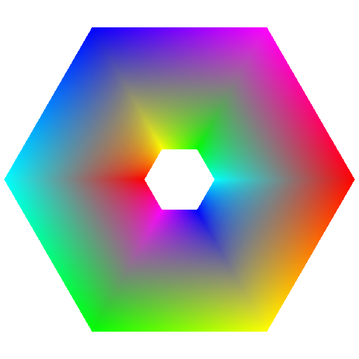
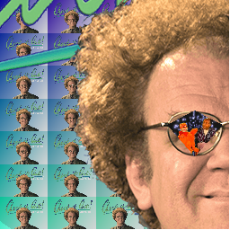

hello!!! 

here you will find my 2D graphics engine, coded entirely in C++. 

here are some examples of drawings one can make with this graphics engine: 

The engine is composed of 6 basic functions: the blend function (to blend colors), the canvas function (to create the canvas), the matrix function, the mesh function, the path function (straight line), the poly function (to draw polygon or quad), and the shader function (to shade in the entire canvas). 

The file maddie_canvas.cpp is the main file, and to create your own program, you will run the GDrawSomething function within this program. 

Admittedly, it is not incredibly user friendly (you need to have a complex understanding of matrix space in order to even control the function). But, I hope you all enjoy the images I was able to make for your entertainment :mage:
